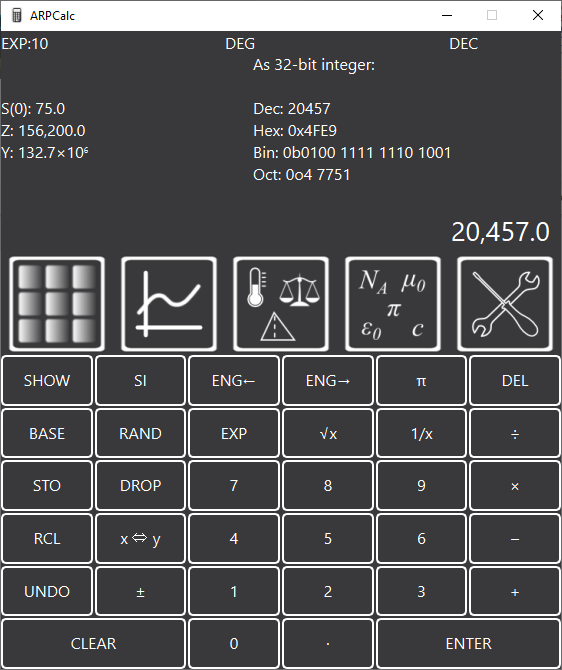
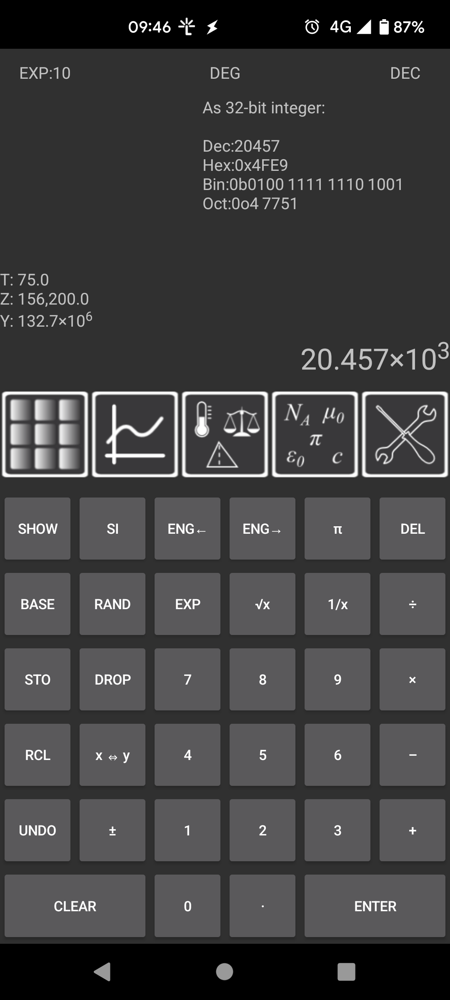
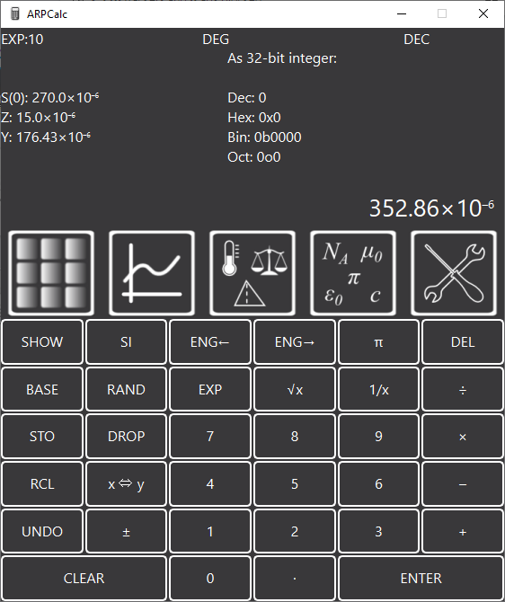
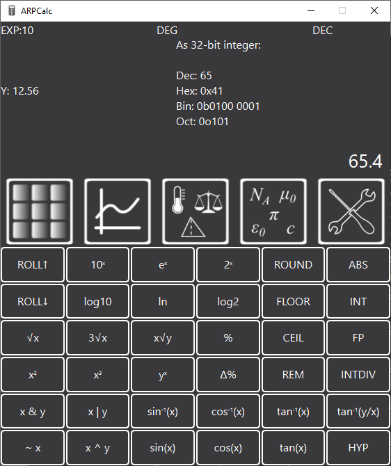
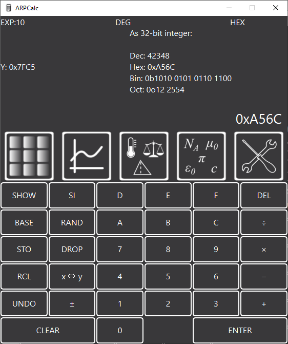
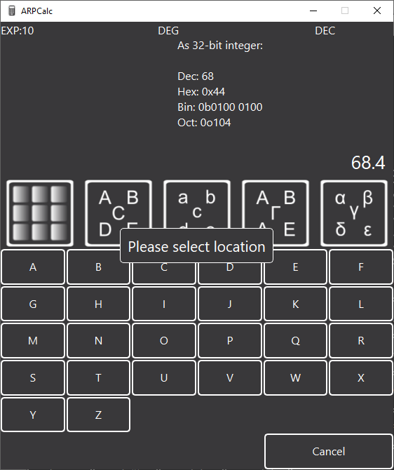
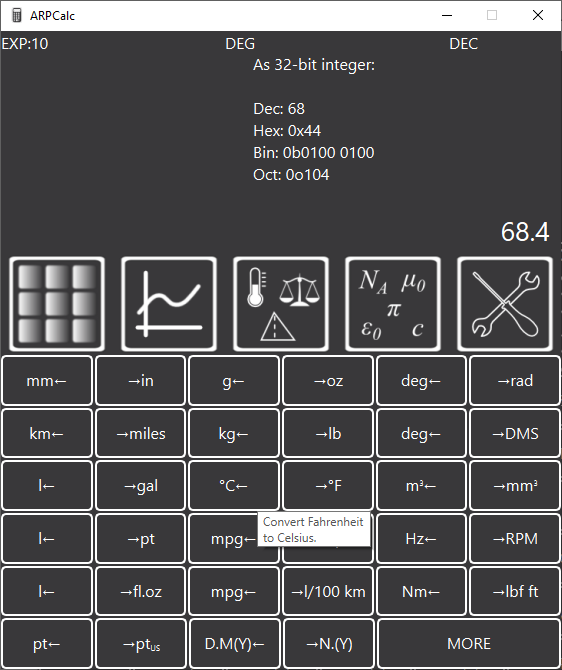
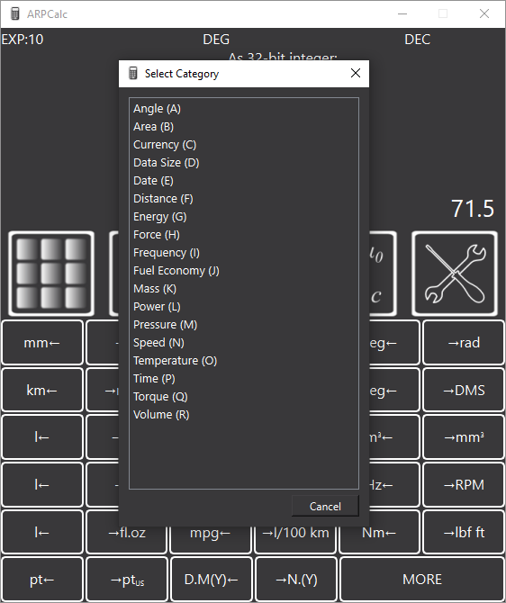
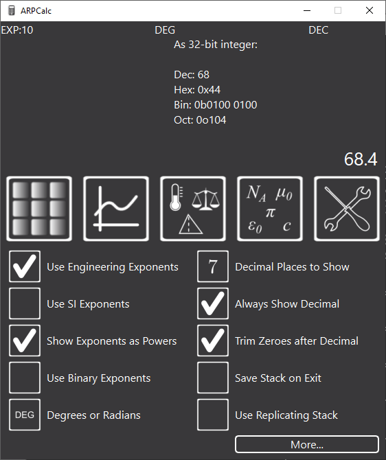
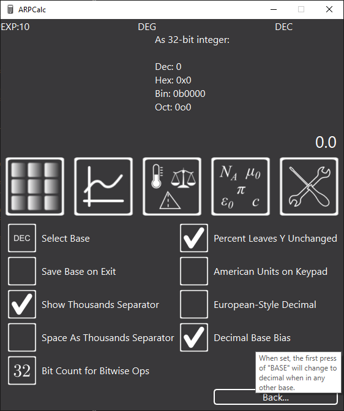

## ARPCalc - Al's Reverse Polish Calculator (Android Version)

### Introduction

I spent a while looking for a decent computer / phone based reverse polish notation (RPN) calculator.  There are a few RPN calculators out there, but I didn't find one I liked.  Most of the mobile phone ones I found tried to emulate a physical calculators, so lots of the functions were crammed into each button and hence the display was cluttered and hard to read.

I've been using this calculator daily since early 2017 so I'm fairly confident it works well.  I've now decided to release it on the website in case others are interested.  Here are a couple of screenshots, one from the Windows version and one from the Android version:

  
  

Note that this repository only contains the code for the Android version; the Windows, Linux and Web Browser based versions are [available here](https://github.com/abudden/arpcalc-desktop).

For more information, please see [the project website](https://www.cgtk.co.uk/software/arpcalc).

### Features

* Dedicated reverse polish calculator with a simple-to-use interface.
* High precision calculations using arbitrary precision floating point arithmetic.
* Cross platform - Android, Windows, Linux or just [run it in your web browser](http://rpn.cgtk.co.uk).
* Keyboard shortcuts for most common functions for speed of use.
* Engineering format numbers (exponents with powers in multiples of 3).
* Buttons to switch between different engineering prefixes (e.g. 10,400, 10.4&times;103, 0.0104&times;106 etc).
* Beautiful formatting of numbers (e.g. 276.3&times;10-6 or 276.3&nbsp;&micro; instead of 0.0002763 or 2.763e-4).
* Instant conversion between different bases (hexadecimal, binary, octal, decimal).
* Conversion between 175 different units and currencies.
* Quick access to common conversions (as chosen by me!)
* Quick entry of SI prefixes:
	- Press `2` `7` `SI` `p` to enter 27&times;10-12
	- On other calculators this would be `2` `7` `EXP` `1` `2` `±` - that method also works in ARPCalc.
	- Keyboard shortcuts make SI units very quick to enter (`2` `7` `Shift-S` `p`).
* 100 memory locations for storing intermediate values.
* Support for binary exponents for maths on bytes (e.g. represent 15,728,640 as 15.0&times;220 or 15.0&nbsp;Mi).
* Display of the stack (this is currently only scrollable in the android version).
* Choice of whether to use an "infinite" stack or a four element replicating one (as used on some of the HP calculators).
* Copy / paste values to/from other applications.  The Windows and Linux versions allow copying in a few different formats (either "pretty" text or as values that will be understood by other applications) - right click on the "X" value to see the options.  The Android version only supports copying the value - long press on the "X" value to copy.  It doesn't support paste.  Copying / pasting isn't currently supported in the web browser version.

### Screenshots

Here are a few screenshots from the Windows version of the application to give you an idea of what it looks like and how it works.

  
  

The left-hand image above (click for bigger!) shows the main number pad, along with the way that numbers are shown (by default) using engineering notation (with exponents in multiples of 3).  The second image shows the function keypad with various functions for scientific and engineering computation.

  
  

The left-hand of these two images shows what the calculator looks like in hexadecimal mode.  The top-right panel shows the X value in all four bases for quick comparison.  The right-hand image shows the view that appears when you press STO (store) or RCL (recall): there are lots of locations to store values in for later use.  Values are saved between sessions.

  
  

The left-hand of these two images shows the unit conversion keypad.  The conversions are in pairs so the one that has been hovered over (and hence shows help information) converts to degrees Celsius from degrees Fahrenheit.  The one to the immediate right of the button converts the other way (although I can't understand why anyone would want to convert to degrees Fahrenheit!).

The right-hand image shows the window that appears when you click "More" on the conversions screen (or press `Ctrl-M`).  The conversions are in categories and each category (and unit) has a shortcut key so if there's a conversion you do often, you can learn the key sequence. For example, to convert from cubic centimetres to litres, you press `Ctrl-M`, `R`, `A`, `J`.

  
  

These two screenshots show the configuration options available in the application.  If you hover over any option, there's a brief description of what it does.

## Licence

This software is released under the GPL.  See [LICENCE.md](LICENCE.md) for more details.

## Docker Compilation

The release builds are compiled with docker-compose.

To build the docker containers on a Linux system, run `docker-compose build`.  The code can then be compiled with `docker-compose up`.

Formal releases are tagged with the Mercurial repository changeset.  Building from the github version will use a git changeset instead.

<!-- vim: set ft=pandoc : -->
